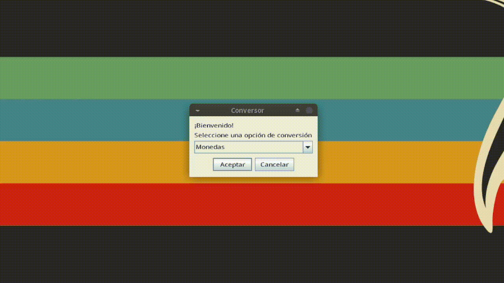

<h1 align="center">:coin: Conversor :coin:</h1>

 

  Conversor de divisas :dollar:, temperatura :thermometer: y almacenamiento :robot:; utilizando el lenguaje Java :coffee:.

  

:coin:

<h2>Funcionalidades del proyecto</h2>

<h4>:dollar: Convierte el Peso Mexicano a ...</h4>
<ul>
  <li>Dólar</li>
  <li>Euro</li>
  <li>Libra Esterlina</li>
  <li>Yen Japonés</li>
  <li>Won Sur Coreano</li>
</ul>

  Y todas las anteriores divisas también las convierte devuelta al Peso Mexicano.

<h4>:thermometer: Convierte los grados °C a ...</h4>
<ul>
  <li>°F</li>
  <li>°K</li>
  <li>°R</li>
</ul>

  Y todos los anteriores grados también las convierte devuelta a °C.

<h4>:robot: Convierte la unidad Byte a ...</h4>
<ul>
  <li>Kilobyte</li>
  <li>Megabyte</li>
  <li>Gigabyte</li>
  <li>Terabyte</li>
</ul>

  Y todas las anteriores unidades de almacenamiento también las convierte devuelta al Byte.

 
 

:coin:

<h2>Tecnologías</h2>
<ul>
  <li>Java 1.8 :coffee:</li>
</ul>

 

:coin:

<h2>Desarrollador del proyecto</h2>
 Hiram Shamed Ambriz Rubio
